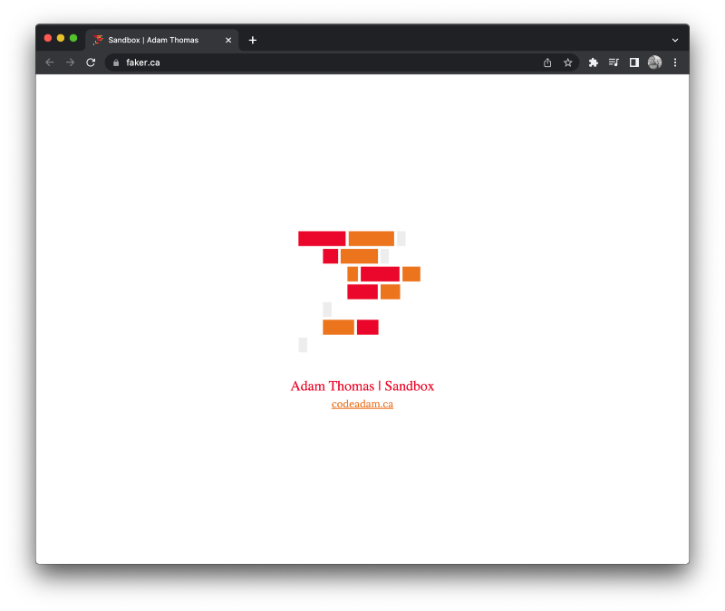

# Faker Splash Page

A simple repo to store the faker.ca splash page. This is my sandbox for testing code online. 

> The splash page can be viewed at:  
> https://faker.ca

***

## Repo Resources

* [Visual Studio Code](https://code.visualstudio.com/)
* [Faker - Splaceh Page](https://faker.ca)

 

